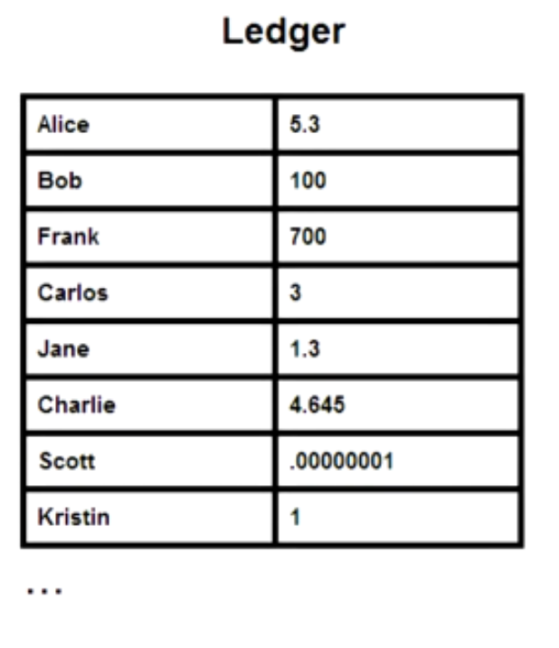

# Blockchain development on Ethereum

---

# What is a Blockchain anyway

---

# Bitcoin intuition

* distributed key value store
* rules for manipulation with decentral validation

---



---


---


---
## GOAL :  UbudCoin - Our own "BitCoin"

---
## Build it
```
contract UbudCoin {
  mapping (address => uint) public balances;

  function UbudCoin(address owner, uint balance) {
    balances[owner] = balance;
  }

  function send(address to, uint amount) {
    if(balances[msg.sender] >= amount) {
      balances[msg.sender] -= amount;
      balances[to] += amount;
    }
  }
}
```

---

## Test it with `dapple test --report`
```
import "dapple/test.sol";
import "./ubudcoin.sol";

contract CoinTest is Test {
  function testInit() {
    var coin = new UbudCoin(this, 42);
    //@log `uint coin.balances(this)`
    coin.send(0x01234, 12);
    uint newBalance = coin.balances(this);
    //@log `uint newBalance`
    assertTrue(newBalance == 30);
  }
}
```

---

## See the report
```
CoinTest
  test init
  LOG:  42
  LOG:  30
  Passed!

Summary
  Passed all 1 tests!
```

---
## Deploy it with `dapple script run Deploy`

```
pragma solidity >= 0.4.0;
import "dapple/script.sol";
import "./ubudcoin.sol";

contract Deploy is Script {
  function Deploy() {
    address owner = msg.sender; // your address here
    var coin = new UbudCoin(owner, 100000);
    export("ubudcoin", coin);
  }
}
```

---

# now we've got our coin!
```
0x3bd562bc1733f8e7b68ef8a95442c79b09e8e5e0
```

---
# Create a UI

```
<h2>Address: <span id="address"></span></h2>
<h2>Balance: <span id="balance"></span></h2>

<input type="text" id="to" placeholder="to"/>
<input type="text" id="value" placeholder="value"/>

<button type="submit" id="sendBtn">send</button>
```

---

```
  var interface = JSON.parse(classes.UbudCoin.interface);
  var Coin = web3.eth.contract(interface);

  var coin = Coin.at('0x3bd562bc1733f8e7b68ef8a95442c79b09e8e5e0')

  var address = web3.eth.coinbase;
  document.getElementById("address")
  .innerText = address;

  coin.balances(address, (err, balance) => {
    document.getElementById("balance")
    .innerText = balance.toString(10);
  });

  document.getElementById("sendBtn")
  .addEventListener('click', () => {
    var to = document.getElementById("to").value
    var value = document.getElementById("value").value
    coin.send(to, value, {
      from: address
    }, (err, txHash) => {
      err ? alert(err) : alert(`Send: ${txHash}`)
    });
  });
```

---
# et voilà - https://ubudcoin.github.io/

---
# Resources

https://github.com/ubudcoin/ubudcoin.github.io

