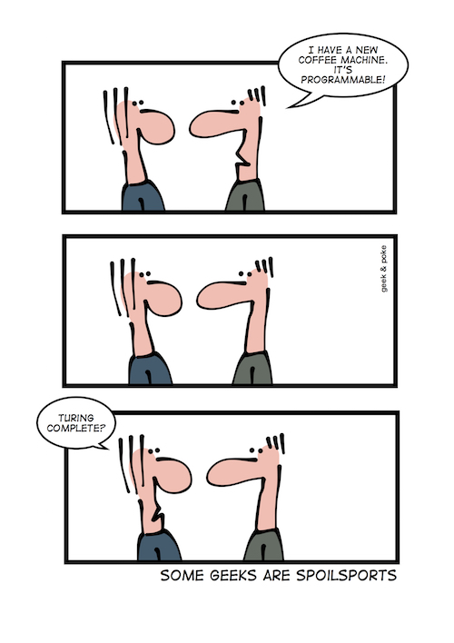

# Blockchain development on Ethereum

---

# What is a Blockchain anyway

---

# Bitcoin intuition

* distributed key value store
* rules for manipulation with decentral validation

---


---



---
## Build it
```
contract Coin {
  mapping (address => uint) public balances;

  function Coin(address owner, uint balance) {
    balances[owner] = balance;
  }

  function send(address to, uint ammount) {
    if(balances[msg.sender] >= ammount) {
      balances[msg.sender] -= ammount;
      balances[to] += ammount;
    }
  }
}
```

---

## Test it with `dapple test --report`
```
import "dapple/test.sol";
import "./coin.sol";

contract CoinTest is Test {
  function testInit() {
    Coin coin = new Coin(this, 42);
    //@log `uint coin.balances(this)`
    coin.send(0x0123456789012345678901234567890123456789, 12);
    uint newBalance = coin.balances(this);
    //@log `uint newBalance`
    assertTrue();
  }
}
```

---

## See the report
```
CoinTest
  test init
  LOG:  42
  LOG:  30
  Passed!

Summary
  Passed all 1 tests!
```

---
## Deploy it


